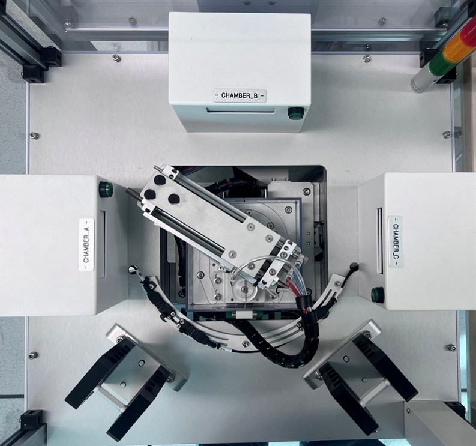
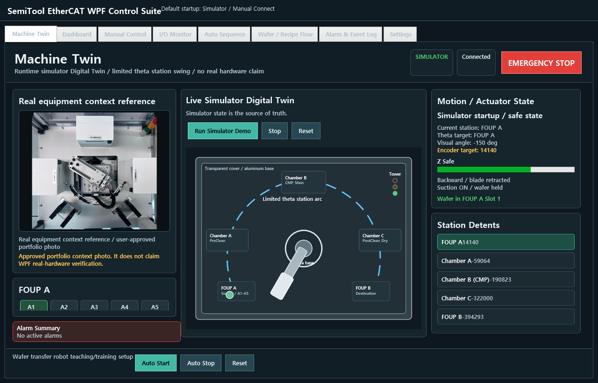
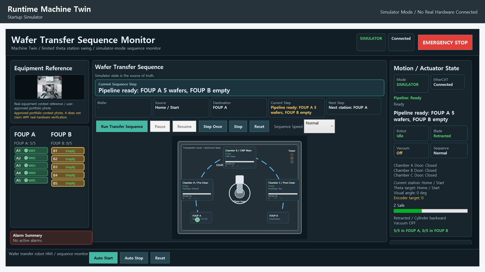
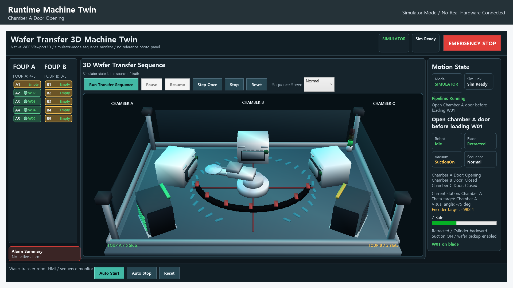
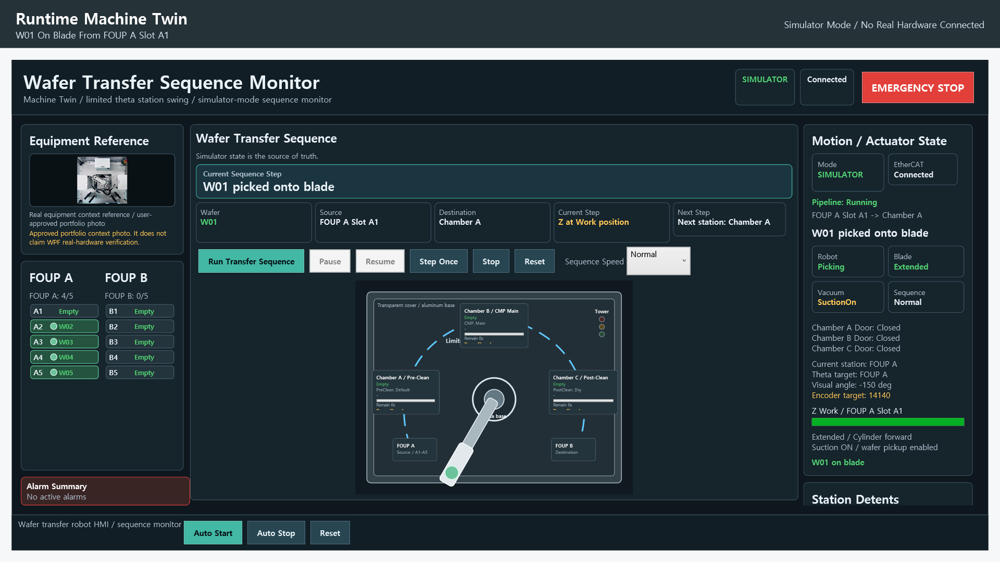

# SemiTool-EtherCAT-WPF-ControlSuite

[English README](README.md)

## Digital Twin 장비 맥락

| Digital Twin Visual | Preview |
|---|---|
| 실제 장비 참고 사진 |  |
| 런타임 Machine Twin |  |
| 제한 θ 스윙 |  |
| 웨이퍼 이송 로봇 |  |
| 블레이드 메커니즘 |  |

실제 장비 사진은 사용자가 포트폴리오 맥락으로 공개해도 된다고 승인한 참고 이미지입니다. 이 사진은 새 WPF 앱이 실제 장비 검증을 완료했다는 주장으로 사용하지 않습니다.

Digital Twin은 웨이퍼 이송 로봇 Teaching 장비를 추상화해서 표현합니다. 고정 알루미늄 베이스, 중앙 θ축 제한 스윙 베이스, 2단/텔레스코픽 블레이드, Z Safe/Work, 실린더 전진/후진, 진공 흡착/배기, FOUP A, Chamber A/B/C, FOUP B, 타워램프 맥락을 보여줍니다.

`CMP Cluster`는 이전 HMI simulator scenario 이름으로 유지합니다. 실제 물리 장비는 웨이퍼 이송 로봇 Teaching 장비로 설명하며, θ축은 360도 무한회전이 아니라 station-to-station 제한 스윙으로 시각화합니다. 보존된 theta 숫자는 encoder position 값이지 literal degree 값이 아닙니다.

단, 새 WPF 앱이 실제 장비에서 검증 완료되었다고 주장하지 않습니다. 현재 저장소는 supervised real-hardware verification을 준비한 상태입니다.

## Runtime Machine Twin UI

실제 실행되는 WPF 앱은 첫 번째 탭으로 `Machine Twin`을 보여줍니다.

이 화면은 문서용 정적 그림이 아니라 `MachineTwinView`와 `MachineTwinViewModel`에 바인딩된 런타임 화면입니다.

상태 매핑 항목은 다음과 같습니다.

- 현재 station과 sequence step
- Simulator / RealHardware mode
- connection state
- 제한 θ축 visual angle
- 보존 theta encoder target
- Z Safe / Work
- blade extend/retract
- cylinder forward/backward
- vacuum suction/exhaust
- wafer 위치
- chamber door indicator
- tower lamp indicator
- alarm summary와 runtime event trace

`Run Simulator Demo` 버튼은 실제 Machine Twin 화면을 다음 순서로 움직입니다.

```text
FOUP A -> Chamber A -> Chamber B -> Chamber C -> FOUP B
```

이 데모는 Simulator mode 전용이며 vendor DLL을 로드하지 않고 실제 장비에 연결하지 않습니다.

첫 번째 runtime debug screenshot은 실제 `MainWindow`에서 `Machine Twin` 탭이 선택된 상태를 캡처합니다. 이 탭은 `<views:MachineTwinView DataContext="{Binding MachineTwin}" />`를 사용하며, `MainViewModel.MachineTwin`은 다른 HMI 탭과 같은 `RuntimeCoordinator`를 공유합니다.

## Runtime UI Evidence Pack

런타임 UI 동작 증거는 다음 경로에 생성됩니다.

- [Runtime UI verification report](docs/debug/latest/ui-runtime-verification.md)
- `docs/debug/latest/machine-twin-state-trace.json`
- `docs/debug/latest/machine-twin-state-trace.csv`
- `docs/debug/latest/event-log.txt`
- `docs/debug/latest/screenshots/*.png`

`docs/debug/latest/screenshots/00-startup-simulator.png`는 실제 실행 셸에서 Machine Twin이 첫 번째/default 탭으로 선택되어 있음을 보여주는 통합 증거입니다.

재생성 명령:

```powershell
dotnet run --project src/SemiTool.Hmi.Wpf/SemiTool.Hmi.Wpf.csproj --configuration Release -- --capture-ui-debug-report
```

## 프로젝트 요약

SemiTool-EtherCAT-WPF-ControlSuite는 실제 EtherCAT 장비를 제어했던 기존 WinForms 프로젝트 경험을 바탕으로 새로 설계한 WPF/MVVM 기반 반도체 장비 제어 HMI 및 시퀀스 플랫폼입니다.

이 저장소는 단순 화면 데모가 아니라, 장비 제어에서 중요한 I/O 매핑, 로봇 포즈, FOUP 슬롯 위치, 타이밍 값, 시퀀스, 알람, 인터락, simulator/real hardware 분리 구조를 포함합니다.

## 왜 화면만 만든 데모가 아닌가

- 기존 WinForms 프로젝트는 실제 EtherCAT 장비 제어에 사용되었습니다.
- 새 WPF 프로젝트는 기존 UI를 그대로 변환하지 않고 MVVM 구조로 재설계했습니다.
- HMI는 Application Service를 호출하고, 모든 하드웨어 접근은 `IEthercatController` 인터페이스 뒤로 격리했습니다.
- 실제 하드웨어 DLL이 없어도 simulator mode로 빌드, 테스트, 시연이 가능합니다.
- real hardware mode는 사용자가 명시적으로 선택하고 unlock/connect해야만 접근됩니다.

## 실제 EtherCAT 프로젝트에서 보존한 것

- DO0~DO15 출력 매핑
- DI0~DI5, DI12, DI13 입력 매핑
- Z/Theta 로봇 포즈
- FOUP slot Z safe/work 위치
- motion wait, door wait, vacuum wait, cylinder timeout 등 타이밍 값
- PM C -> FOUP B, PM B -> PM C, PM A -> PM B, FOUP A -> PM A 우선순위

보존값은 `config/EquipmentProfile.finaltest.json`에 있으며 단위 테스트로 검증합니다.

## 아키텍처 요약

```text
WPF HMI
  -> ViewModel / Command
  -> Application Service
  -> IEthercatController
  -> SimulatedEthercatController 또는 Ieg3268EthercatController
  -> Digital I/O, motion, cylinder, vacuum, door, lamp
```

## 안전 설계

- 시작 기본값은 Simulator mode입니다.
- 시작 시 real hardware 자동 연결이 없습니다.
- 시작 시 auto-run이 없습니다.
- 시작 시 축 자동 이동이 없습니다.
- 시작 시 출력은 OFF 상태입니다.
- manual command는 auto running 중 차단됩니다.
- auto start는 connection과 homing 조건을 확인합니다.
- emergency stop은 simulator 출력 OFF와 alarm 상태 전환을 테스트합니다.

## Simulator Mode

Simulator mode는 개발 PC에서 vendor DLL 없이 실행됩니다.

```powershell
dotnet run --project src/SemiTool.Hmi.Wpf/SemiTool.Hmi.Wpf.csproj
```

포트폴리오용 simulator 화면은 다음 명령으로 생성할 수 있습니다.

```powershell
dotnet run --project src/SemiTool.Hmi.Wpf/SemiTool.Hmi.Wpf.csproj -- --capture-demo-assets
```

## Real Hardware Mode 경계

이 WPF 프로젝트는 real hardware mode를 위한 adapter 구조를 준비했지만, 새 WPF 구현이 실제 장비에서 검증되었다고 주장하지 않습니다.

실제 장비 검증에는 local `IEG3268_Dll.dll`, 장비 전원, EtherCAT 연결, E-stop, wiring, operator supervision, 학교 장비 환경에서의 commissioning이 필요합니다.

자세한 DLL 배치와 아키텍처 주의사항은 [Real hardware DLL notes](docs/real-hardware-dll-notes.md)를 참고하면 됩니다.

Digital Twin 물리 모델과 블레이드/θ축 설명은 [Physical equipment model](docs/physical-equipment-model.md), [Blade transfer mechanism](docs/blade-transfer-mechanism.md), [Theta limited swing model](docs/theta-limited-swing.md)에 정리했습니다.

공개 GitHub 저장소에는 vendor DLL을 포함하지 않습니다. 실제 장비 PC 또는 Visual Studio 로컬 환경에서는 `libs/IEG3268_Dll.dll`에 DLL을 두거나 Settings에서 절대경로를 지정할 수 있습니다.

DLL은 RealHardware mode를 선택하고 hardware unlock 후 Connect를 눌렀을 때만 로드됩니다. Simulator mode와 simulator visual asset은 DLL 없이 동작합니다.

## Build / Test / CI 상태

- GitHub Actions `.NET CI`: 통과
- Local Release build: 통과
- Unit tests: 41 passed / 0 failed
- Safety audit: vendor DLL, exe, pdb, bin, obj, legacy zip 추적 없음

## 면접 설명

기존 프로젝트에서는 WinForms 기반 프로그램으로 실제 EtherCAT 장비를 제어했습니다. 이 포트폴리오 프로젝트에서는 그 경험을 WPF/MVVM 구조로 재설계했습니다.

핵심은 화면만 만든 것이 아니라, 실제 장비에서 사용했던 DO/DI 매핑, 로봇 포즈, FOUP 슬롯 위치, 타이밍 값, 이송 우선순위를 `EquipmentProfile`로 분리하고 테스트로 보존했다는 점입니다.

또한 simulator mode와 real hardware mode를 분리해 안전하게 개발 PC에서 검증할 수 있게 했고, 실제 장비 접근은 `IEthercatController`와 `Ieg3268EthercatController` 뒤로 격리했습니다.

## 실제 장비 검증 전 현재 상태

현재 저장소는 simulator 기준으로 build/test/CI와 visual demo asset 생성까지 완료된 상태입니다. 실제 장비 검증 전이므로 README와 문서에서는 새 WPF 앱의 real hardware 검증 완료를 주장하지 않습니다.

## 학교 장비 검증 후 추가할 항목

- 실제 장비 commissioning checklist 결과
- 짧은 real hardware 동작 영상 또는 승인된 캡처
- I/O monitor 실제 센서 반응 기록
- Servo ON, homing, small move, cylinder/vacuum/door 검증 기록
- alarm/reset recovery 기록
