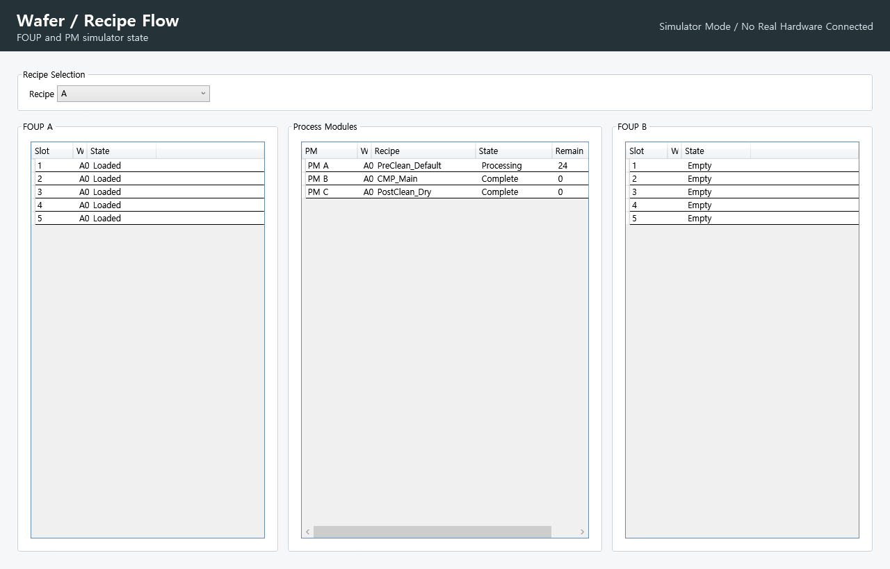
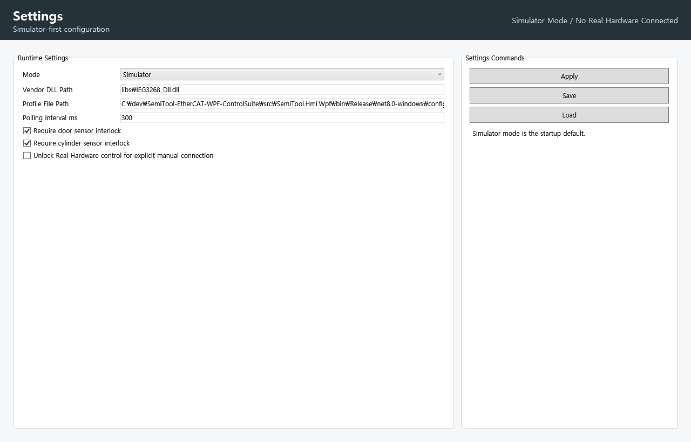

# SemiTool-EtherCAT-WPF-ControlSuite

[English README](README.md)

## 최신 3D Machine Twin

공개용 스크린샷은 이제 실제 실행 앱의 첫 번째 탭에 표시되는 WPF `Viewport3D` Machine Twin 화면을 사용합니다. 예전 왼쪽 상단 장비 참조 사진 패널은 런타임 화면에서 제거되었습니다.

## 현재 구현된 3D 파이프라인 설명

GitHub 첫 화면에서 바로 확인할 수 있도록 현재 WPF 앱의 3D Machine Twin 동작 기준을 정리했습니다.

| 순서 | UI 동작 | 확인 포인트 |
| --- | --- | --- |
| 1 | `Home / Start` 안전 위치 | 블레이드는 접힌 상태, Z Safe, FOUP A 5장 / FOUP B 0장 |
| 2 | FOUP A 슬롯 선택 | Home에서 바로 전진하지 않고 FOUP A 각도(`-120 deg`)로 먼저 회전 |
| 3 | 슬롯 높이 이동 | A1~A5 각 슬롯에 맞춰 Z Work 위치로 이동 |
| 4 | FOUP A 픽업 | 블레이드 전진, 진공 흡착, FOUP A 카운트 1장 감소 |
| 5 | Chamber A 투입 및 공정 | 문 열림, 블레이드 진입, 웨이퍼는 챔버 내부로 숨김, 문 닫힘 후 공정 |
| 6 | Chamber B 이동 및 공정 | Chamber A 완료 후 B로 이송, B 내부 공정 상태 유지 |
| 7 | Chamber C 이동 및 공정 | Chamber B 완료 후 C로 이송, C 내부 공정 상태 유지 |
| 8 | FOUP B 적재 | Chamber C 완료 후 FOUP B 슬롯 B1~B5에 순서대로 적재 |
| 9 | 완료 상태 | FOUP A 0/5, FOUP B 5/5, 오른쪽 경광등 노란 완료 상태 |

전체 5장 파이프라인 검증 자료:

- [Full pipeline QA summary](docs/debug/latest/full-pipeline/full-pipeline-qa-summary.md)
- [Full pipeline operator review](docs/debug/latest/full-pipeline/full-pipeline-operator-review.md)
- [Full pipeline contact sheet](docs/debug/latest/full-pipeline/full-pipeline-contact-sheet.png)

| 런타임 화면 | 미리보기 |
| --- | --- |
| 3D Machine Twin |  |

같은 WPF 화면에서 생성한 시퀀스 프레임:

- [FOUP A 픽업 위치](docs/images/sequence-frame-01.png)
- [Chamber A 진입](docs/images/sequence-frame-02.png)
- [Chamber A 공정 진행](docs/images/sequence-frame-03.png)
- [FOUP B 완료](docs/images/sequence-frame-04.png)

## Machine Twin 동작 기준

`Run Transfer Sequence`는 5장 웨이퍼 파이프라인을 시뮬레이터 기준으로 구동합니다.

```text
FOUP A -> Chamber A -> Chamber B -> Chamber C -> FOUP B
```

UI 동작은 스테이션 순서를 명확히 보이도록 설계했습니다.

- Reset은 `Home / Start`로 돌아가며 블레이드는 접힌 상태를 유지합니다.
- 픽업은 Home에서 FOUP A 각도로 먼저 이동한 뒤 Z Work와 블레이드 전진을 진행합니다.
- FOUP A는 5장 웨이퍼가 슬롯별로 하나씩 빠지며 `5/5`에서 `0/5`로 감소합니다.
- Chamber A/B/C에 들어간 웨이퍼는 공정 중 챔버 내부에 숨겨져 바깥으로 튀어나와 보이지 않습니다.
- 챔버 문이 열려 있거나 웨이퍼가 챔버 안에 있으면 챔버 버튼은 초록 상태를 유지합니다.
- FOUP B는 `0/5`에서 `5/5`로 채워집니다.
- 오른쪽 경광등을 런타임 상태등으로 사용합니다. 진행 중은 초록, 일시정지/정지 계열은 빨강, 전체 파이프라인 완료는 노랑으로 표시합니다.

UI 각도는 HMI 표시용 각도입니다. `config/EquipmentProfile.finaltest.json`에 보존된 실제 theta encoder teaching 값은 임의로 바꾸지 않습니다.

## 검증 근거

최신 시뮬레이터 전용 검증 자료:

- [런타임 검증 README](docs/debug/latest/runtime-verification/README.md)
- [UI 런타임 검증 리포트](docs/debug/latest/ui-runtime-verification.md)
- [전체 파이프라인 작업자 검토](docs/debug/latest/full-pipeline/full-pipeline-operator-review.md)
- [전체 파이프라인 QA 요약](docs/debug/latest/full-pipeline/full-pipeline-qa-summary.md)
- `docs/debug/latest/runtime-verification/dev-actual/*.png`
- `docs/debug/latest/full-pipeline/screenshots/*.png`

검증 캡처는 실제 개발 경로인 `C:\dev\SemiTool-EtherCAT-WPF-ControlSuite`에서 생성했습니다.

## 추가 HMI 화면

| 화면 | 미리보기 |
| --- | --- |
| Dashboard |  |
| Manual Control |  |
| I/O Monitor |  |
| Auto Sequence |  |
| Wafer / Recipe Flow |  |
| Alarm & Event Log |  |
| Settings |  |

## 안전 경계

WPF 앱은 Simulator mode로 시작합니다. 시작 시 자동 연결, 자동 실행, 자동 원점, 자동 모션, 출력 활성화를 하지 않습니다.

Real Hardware mode는 작업자가 명시적으로 모드를 선택하고 unlock한 뒤 수동으로 Connect해야만 사용할 수 있습니다. vendor DLL은 `Ieg3268EthercatController` 내부에서만 로드됩니다. 캡처 명령은 실제 EtherCAT 장비에 연결하지 않습니다.

현재 저장소 상태는 학교 장비에서 실장비 검증을 완료했다고 주장하지 않습니다. 시뮬레이터 검증 자료를 실장비 commissioning 완료 자료처럼 설명하면 안 됩니다.

## 보존 장비값

아래 값은 새로 승인된 `EquipmentProfile.finaltest.json`이 없는 한 변경하지 않습니다.

- DO0-DO15 출력 맵
- DI0-DI5, DI12-DI13 입력 맵
- Home, FOUP A/B, Chamber A/B/C 로봇 pose
- FOUP slot Z safe/work 값
- motion, door, cylinder, vacuum, polling, auto tick timing 값
- auto scheduler priority

HMI와 sequence logic은 raw DO/DI 번호가 아니라 named I/O point와 하드웨어 추상화 경계를 사용합니다.

## 빌드, 테스트, 캡처

```powershell
dotnet restore SemiTool.EtherCAT.WPF.ControlSuite.sln
dotnet build SemiTool.EtherCAT.WPF.ControlSuite.sln --configuration Debug
dotnet test SemiTool.EtherCAT.WPF.ControlSuite.sln --configuration Debug --no-build --no-restore
```

GitHub 공개 이미지 재생성:

```powershell
dotnet run --project src/SemiTool.Hmi.Wpf/SemiTool.Hmi.Wpf.csproj --configuration Release -- --capture-sequence-assets
```

Windows App Control이 생성된 Release DLL을 `0x800711C7`로 차단하면 `--` 앞에 `-p:Deterministic=false`를 붙여 다시 실행합니다.

검증 자료 재생성:

```powershell
dotnet run --project src/SemiTool.Hmi.Wpf/SemiTool.Hmi.Wpf.csproj --configuration Release -- --capture-ui-debug-report
dotnet run --project src/SemiTool.Hmi.Wpf/SemiTool.Hmi.Wpf.csproj --configuration Release -- --capture-full-pipeline-qa
```

## 프로젝트 구조

```text
src/SemiTool.Hmi.Wpf        WPF view, ViewModel, command, bootstrap
src/SemiTool.Domain         장비 모델, enum, profile 객체
src/SemiTool.Application    sequence, scheduler, alarm, interlock, recipe, event log
src/SemiTool.Hardware       IEthercatController, simulator, real IEG3268 adapter
src/SemiTool.Infrastructure config/settings/profile loading, CSV support
src/SemiTool.Tests          보존값과 동작 검증 테스트
```
