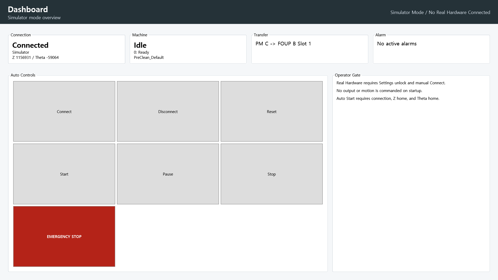
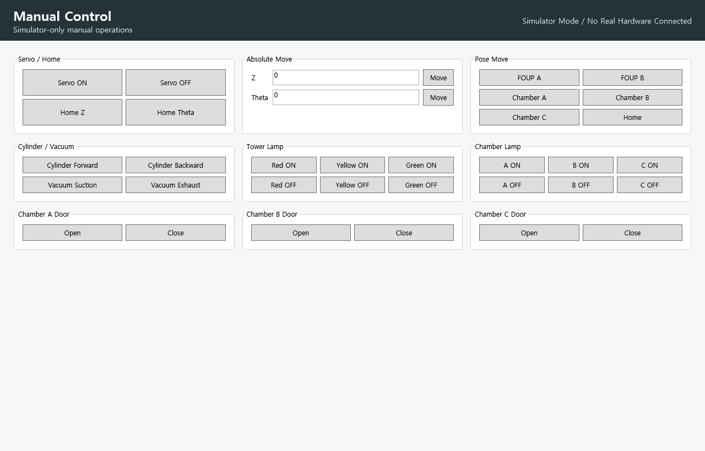
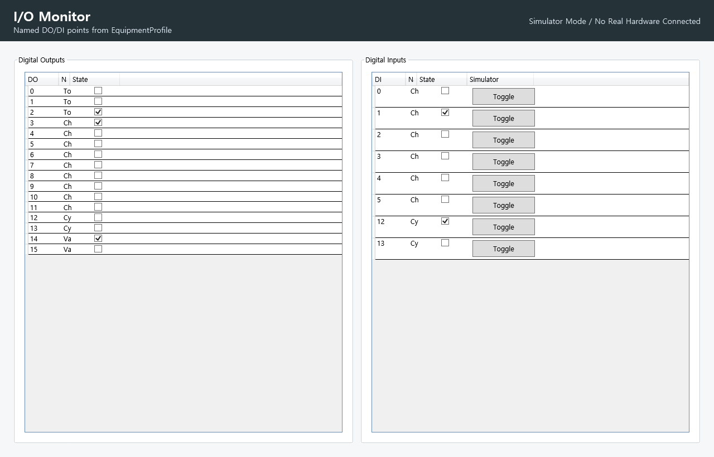
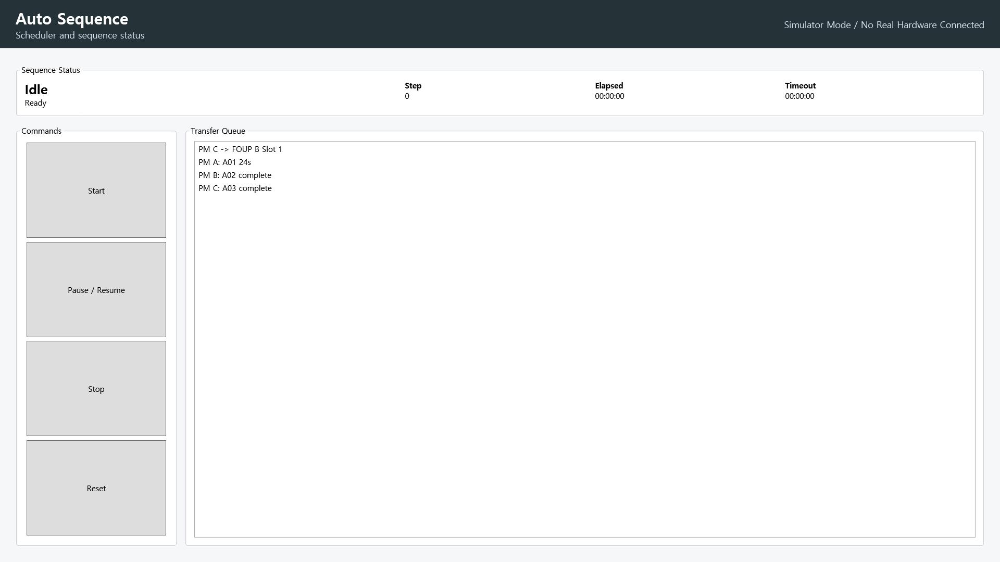
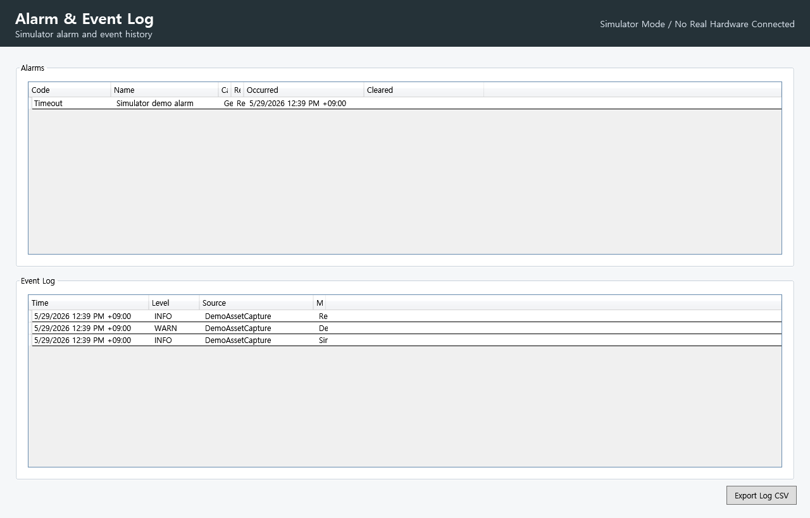

# SemiTool-EtherCAT-WPF-ControlSuite

[](https://github.com/JJY0910/SemiTool-EtherCAT-WPF-ControlSuite/actions/workflows/dotnet-ci.yml)

[한국어 README](README.ko.md)

## Visual Demo

These screenshots are simulator-mode visuals generated from the WPF UI. The original WinForms project controlled real EtherCAT hardware; the new WPF implementation is prepared for supervised real-hardware verification.

| Screen | Preview |
|---|---|
| Dashboard |  |
| Manual Control |  |
| I/O Monitor |  |
| Auto Sequence |  |
| Alarm & Event Log |  |

Simulator demo frames: [01](docs/images/simulator-demo-frame-01.png), [02](docs/images/simulator-demo-frame-02.png), [03](docs/images/simulator-demo-frame-03.png), [04](docs/images/simulator-demo-frame-04.png)

## Digital Twin Equipment Context

| Digital Twin Visual | Preview |
|---|---|
| Limited theta swing |  |
| Wafer transfer robot |  |
| Blade mechanism |  |

The Digital Twin now uses an abstract wafer transfer robot teaching-equipment model: fixed aluminum-like base, central limited-swing theta base, two-stage/telescopic blade/end-effector, Z Safe/Work movement, cylinder extend/retract, vacuum hold/release, FOUP A, Chamber A/B/C, FOUP B, and tower lamp context.

`CMP Cluster` is treated as a previous-year simulator/HMI scenario name. The physical teaching setup is explained as a wafer transfer robot. The theta axis is displayed as a limited station-to-station swing, not a 360-degree continuous rotation. Preserved theta values remain encoder positions, not literal UI degrees.

The visuals are simulator-mode/generated abstractions. The repository does not include the user reference photo and does not claim that the new WPF app has already been verified on the physical machine.

## Summary

SemiTool-EtherCAT-WPF-ControlSuite is a WPF/MVVM semiconductor equipment-control HMI and sequence platform rebuilt from a legacy WinForms EtherCAT project that successfully controlled real hardware.

This is not a simple screen conversion. The new project separates the HMI, application services, sequence logic, scheduler, hardware abstraction, simulator, real EtherCAT adapter, configuration, alarms, interlocks, logs, recipes, and wafer transfer flow.

The original WinForms project controlled real EtherCAT hardware. This new WPF project preserves the real equipment values and is prepared for supervised real-hardware verification, but it does not claim that the new WPF implementation has already been verified on the physical machine.

## Portfolio Highlights

- Real EtherCAT equipment-control experience base
- WPF/MVVM redesign from a legacy WinForms control project
- Simulator-first safe startup
- No auto-connect on startup
- No auto-run on startup
- No automatic motion on startup
- All outputs off on startup
- Real hardware adapter isolated behind `IEthercatController`
- Preserved DO/DI, robot pose, FOUP slot, and timing values in `EquipmentProfile`
- Async sequence logic with cancellation, timeout, alarm, and interlock handling
- Unit tests for preserved values and simulator behavior
- Public repository excludes vendor DLLs and legacy binaries

## Current Verification Status

- Build: passed locally
- Tests: 37 passed locally
- GitHub Actions: enabled for Windows .NET build/test
- Simulator mode: ready for developer PC verification
- Real hardware mode: prepared for verification with local `IEG3268_Dll.dll` and school equipment

## Verification Documents

- [Simulator verification](docs/simulator-verification.md)
- [Quality gates](docs/quality-gates.md)
- [Physical equipment model](docs/physical-equipment-model.md)
- [Blade transfer mechanism](docs/blade-transfer-mechanism.md)
- [Theta limited swing model](docs/theta-limited-swing.md)
- [Real hardware DLL notes](docs/real-hardware-dll-notes.md)
- [Real hardware commissioning checklist](.github/ISSUE_TEMPLATE/real-hardware-commissioning.md)

## Demo Plan

- Add simulator demo GIF: `docs/images/simulator-demo.gif`
- Add Dashboard screenshot: `docs/images/dashboard.png`
- Add Manual Control screenshot: `docs/images/manual-control.png`
- Add I/O Monitor screenshot: `docs/images/io-monitor.png`
- Add Auto Sequence screenshot: `docs/images/auto-sequence.png`
- Add Alarm/reset screenshot: `docs/images/alarm-log.png`
- Add short real-equipment verification video only after supervised commissioning

## TODO: Actual Equipment Verification

- [ ] Run simulator mode on a developer PC
- [ ] Capture simulator screenshots
- [ ] Place local vendor DLL outside git
- [ ] Confirm E-stop and wiring before real hardware mode
- [ ] Connect real hardware manually
- [ ] Verify Servo ON
- [ ] Verify Z homing
- [ ] Verify Theta homing
- [ ] Verify small Z move
- [ ] Verify small Theta move
- [ ] Verify DO channels
- [ ] Verify DI sensors
- [ ] Verify cylinder forward/backward
- [ ] Verify vacuum suction/exhaust
- [ ] Verify chamber door open/close
- [ ] Verify short auto sequence
- [ ] Verify alarm/reset recovery
- [ ] Capture approved real-hardware verification media

## Why This Is Real Equipment-Control Related

The preserved I/O map, Z/Theta robot poses, FOUP slot positions, timing constants, and transfer priority came from the original EtherCAT equipment-control project.

The new project keeps those values in `config/EquipmentProfile.finaltest.json` and protects them with unit tests.

The HMI starts in Simulator mode. Real Hardware mode is present, but the vendor DLL is loaded only by `Ieg3268EthercatController` at runtime.

## Architecture

```text
WPF HMI
  -> ViewModels / Commands
  -> Application Services
  -> IEthercatController
  -> SimulatedEthercatController OR Ieg3268EthercatController
  -> Digital I/O, motion axes, cylinder, vacuum, doors, lamps
```

Project layout:

```text
src/SemiTool.Hmi.Wpf        WPF views, ViewModels, commands, bootstrap
src/SemiTool.Domain         Equipment models, enums, profile objects
src/SemiTool.Application    Sequence, scheduler, alarms, interlocks, recipes, event logs
src/SemiTool.Hardware       IEthercatController, simulator, real IEG3268 adapter
src/SemiTool.Infrastructure Config/settings/profile loading and CSV support
src/SemiTool.Tests          Value preservation and behavior tests
```

## Screens

- Dashboard
- Manual Control
- I/O Monitor
- Auto Sequence
- Wafer / Recipe Flow
- Alarm & Event Log
- Settings

## Simulator Mode

Run:

```powershell
dotnet run --project src/SemiTool.Hmi.Wpf/SemiTool.Hmi.Wpf.csproj
```

Startup mode is Simulator. Click `Connect`, then use Manual Control for servo, home, move, and output checks.

Simulator input states can be toggled in the I/O Monitor.

## Real Hardware Mode

1. Keep vendor DLLs out of git.
2. Place the local vendor DLL at `libs/IEG3268_Dll.dll` or set the path in Settings.
3. In Settings, select `RealHardware`.
4. Confirm hardware unlock.
5. Apply settings.
6. Click `Connect` manually.

If the DLL is missing, Real Hardware mode reports a clear connection error and Simulator mode remains usable.

If `libs/IEG3268_Dll.dll` exists locally, the WPF project conditionally copies it to the output folder without committing it. Absolute DLL paths are also supported in Settings.

The real hardware adapter resolves and loads the DLL only after Real Hardware mode is selected, hardware unlock is enabled, and Connect is clicked.

## Safety Warning

Real hardware mode can move axes and actuate outputs.

Use only with the correct machine, verified wiring, E-stop path, and operator supervision.

Disconnect, Emergency Stop, communication failure, or fatal alarm should stop motion where possible and turn off risky outputs.

## Preserved Hardware Values Summary

Digital outputs:

```text
DO0  Tower Red
DO1  Tower Yellow
DO2  Tower Green
DO3  Chamber A Lamp
DO4  Chamber A Door Close
DO5  Chamber A Door Open
DO6  Chamber B Lamp
DO7  Chamber B Door Close
DO8  Chamber B Door Open
DO9  Chamber C Lamp
DO10 Chamber C Door Close
DO11 Chamber C Door Open
DO12 Cylinder Forward
DO13 Cylinder Backward
DO14 Vacuum Suction
DO15 Vacuum Exhaust
```

Digital inputs:

```text
DI0  Chamber A Door Open Sensor
DI1  Chamber A Door Close Sensor
DI2  Chamber B Door Open Sensor
DI3  Chamber B Door Close Sensor
DI4  Chamber C Door Open Sensor
DI5  Chamber C Door Close Sensor
DI12 Cylinder Rear Sensor
DI13 Cylinder Front Sensor
```

Robot poses, FOUP slot Z values, timing constants, and recipes are preserved in `config/EquipmentProfile.finaltest.json` and covered by tests.

## Build / Test

```powershell
dotnet restore SemiTool.EtherCAT.WPF.ControlSuite.sln
dotnet build SemiTool.EtherCAT.WPF.ControlSuite.sln
dotnet test SemiTool.EtherCAT.WPF.ControlSuite.sln --no-build --no-restore
```

## Portfolio Explanation

This project demonstrates how real WinForms-based EtherCAT equipment-control experience can be redesigned into a safer WPF/MVVM architecture.

It keeps the equipment constants that mattered on hardware, while introducing simulator-first startup, named I/O points, async sequences, interlocks, alarm logging, and a reflection-isolated real hardware adapter.

## Interview Explanation

English:

```text
My previous project controlled real EtherCAT equipment from a WinForms application.
For this portfolio project I redesigned that experience as a clean WPF/MVVM control suite.
The preserved digital I/O map, Z/Theta poses, FOUP slot positions, timing values, and transfer priority are stored in an EquipmentProfile JSON file and protected by unit tests.
The UI talks to ViewModels, the ViewModels call application services, and all hardware access goes through IEthercatController.
Simulator mode runs on any developer PC, while real hardware mode is isolated behind a runtime-loaded IEG3268 adapter.
```

Korean:

```text
기존 프로젝트에서는 WinForms 기반 프로그램으로 실제 EtherCAT 장비를 제어했습니다.
이 프로젝트에서는 그 경험을 바탕으로 WPF/MVVM 구조의 장비 제어 HMI와 시퀀스 플랫폼을 새로 설계했습니다.
실제 장비에서 사용했던 DO/DI 맵, Z/Theta 포즈, FOUP 슬롯 위치, 타이밍 값, 이송 우선순위를 EquipmentProfile JSON으로 분리했고 단위 테스트로 보존값을 검증합니다.
UI는 ViewModel을 통해 Application Service를 호출하고, 실제 하드웨어 접근은 IEthercatController 인터페이스 뒤로 격리했습니다.
하드웨어가 없는 PC에서는 Simulator 모드로 동작하고, 실제 장비 모드는 IEG3268 어댑터에서 vendor DLL을 런타임에 로드하도록 분리했습니다.
```
